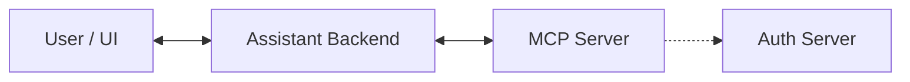

# MCP Integration Demo Guide

This document explains the **What**, **How**, and **Why** of the MCP (Model Context Protocol) Integration Proof-of-Concept (POC). It is designed to help you demonstrate the capabilities of the system, specifically focusing on handling complex user interactions like Forms and Authentication through standard and advanced MCP patterns.

## 1. What is this Project?

This project is a reference implementation of an **AI Assistant** that can connect to external tools via **MCP**. It demonstrates how an LLM can not only call simple tools but also handle complex scenarios where the tool needs to "ask" the user for more information during execution.

### Key Features
1.  **Standard Tool Calling**: The assistant can call simple tools (e.g., "echo message").
2.  **Legacy Elicitation (V1)**: The tool returns a special "Form Request" payload. The assistant interprets this, asks the user, and *re-calls* the tool with the new data.
3.  **Server-Driven Elicitation (V2)**: The tool *pauses* its own execution, sends a request to the assistant to ask the user, and then *resumes* exactly where it left off once the user responds.
4.  **Authentication flows**: Demonstrating OAuth flows triggered by tools.

---

## 2. Architecture Overview

The system consists of three main components:



1.  **User / UI**: The chat interface (Streamlit) where the user types messages and fills out forms.
2.  **Assistant Backend**: The "Client" in MCP terminology. It manages the conversation history and connects to the MCP server.
3.  **MCP Server**: The "Server". It hosts the tools (`create_ticket`, `login`, etc.).
4.  **Auth Server**: A mock OAuth provider to demonstrate login flows.

---

## 3. The "How": Technical Implementation

### A. Simple Tools (The Baseline)
*   **Goal**: Run a function and get a result.
*   **How**: Standard MCP pattern.
*   **Code Example**:
    ```python
    @mcp.tool()
    async def simple_tool(message: str) -> str:
        return f"Processed: {message}"
    ```

### B. Legacy Elicitation (V1) - "Stateless Re-entry"
*   **Goal**: The tool needs a Form filled out by the user.
*   **Mechanism**:
    1.  Assistant calls `create_ticket(initial_description="...")`.
    2.  Tool checks args. If missing details, it returns a **JSON payload** describing the form.
    3.  Assistant sees this payload, renders a form to the user.
    4.  User submits form.
    5.  Assistant calls `create_ticket` **AGAIN**, this time with all the fields filled.
*   **Why implementation looks like this**:
    ```python
    # V1 Pattern
    @mcp.tool()
    async def create_ticket(initial_description, reporter_name=None, ...):
        # Check if we have all data
        if reporter_name and priority:
             return create_the_ticket(...)
        
        # If not, return request for more info
        return json.dumps({
            "type": "elicitation",
            "elicitation_type": "form",
            "fields": [...]
        })
    ```
*   **Trade-off**: The tool must be designed to handle "partial" calls. It is stateless.

### C. Server-Driven Elicitation (V2) - "Stateful Suspension"
*   **Goal**: A more natural, conversational flow where the tool guides the interaction.
*   **Mechanism**:
    1.  Assistant calls `create_ticket_v2`.
    2.  The code hits `await ctx.session.elicit_form(...)`.
    3.  **Execution PAUSES** on the server.
    4.  Assistant receives a "Sampling/Create Message" request, asks the user.
    5.  User answers. Assistant sends the answer back.
    6.  **Execution RESUMES** on the server on the very next line.
*   **Why implementation looks like this**:
    ```python
    # V2 Pattern
    @mcp.tool()
    async def create_ticket_v2(ctx: Context, initial_description: str):
        # 1. Do some work
        print("Starting...")
        
        # 2. Ask user for input (Pauses here!)
        result = await ctx.session.elicit_form("Please provide details...")
        
        # 3. Resume with data
        data = result.content
        return create_the_ticket(data)
    ```
*   **Benefit**: The code reads linearly. You can have multiple back-and-forth steps in a single function (e.g., `book_appointment_v2` asks for Name, then Date).

---

## 4. The "Why": Design Decisions

### Why use MCP?
*   **Standardization**: Instead of writing custom API wrappers for every tool (Jira, GitHub, Google Drive), MCP provides a standard way to expose tools.
*   **Portability**: The same MCP server can be used by Claude Desktop, this custom Assistant, or any other MCP client.

### Why Server-Driven Elicitation (V2)?
*   **Complexity Management**: V1 requires the client to know too much about the tool's logic (re-calling with specific parameters). V2 encapsulates the logic entirely on the server.
*   **Multi-turn Workflows**: Implementing a 5-step wizard in V1 is a nightmare of state management. In V2, it's just 5 lines of `await ctx.session.elicit_...`.
*   **Security**: The server controls the flow. It doesn't rely on the client to "replay" the right data.

### Why maintain Legacy (V1)?
*   **Compatibility**: Not all clients support the advanced "Sampling" or "Server-side Request" features of MCP. V1 works with even the simplest LLM loop.

---

## 5. Session Management & State

The demo handles state differently depending on the elicitation mode:

### A. UI Session (Streamlit)
*   **Storage**: In-Memory (`st.session_state`).
*   **Scope**: Per browser tab.
*   **Mechanism**: The UI generates a UUID `session_id` on load. It preserves the chat history and any active form data within the user's browser session.

### B. V1 State (Legacy)
*   **Model**: **Client-Side State**.
*   **Details**: The MCP server is stateless. It forgets everything after returning the "Form Request". The **UI** must hold the context (the form fields, original intent) and resubmit everything in the second call.
*   **Pros/Cons**: scalable (RESTful), but puts heavy burden on the client to manage complex multi-step state.

### C. V2 State (Server-Driven)
*   **Model**: **Server-Side State**.
*   **Details**:
    *   **MCP Server**: Uses Python's `async/await` stack frames to hold state. The function is physically *paused* in memory. Variables like `step1_result` are preserved in the function's local scope.
    *   **Assistant Backend**: Holds a persistent WebSocket/SSE connection to the MCP server.
    *   **POC Limitation**: The current demo backend uses a **Global Singleton** connection. This means it supports only **one active user at a time** for V2 flows (Single-Player Mode).

---

## 6. Production Considerations (Q&A)

### Q: How to handle the "Singleton" limitation in production?
In a real-world multi-user scenario, you cannot share a single MCP connection across all users because V2 interactions are stateful.
**Solutions**:
1.  **Connection Pooling**: The Backend maintains a pool of connections. When a user starts a flow, check out a connection and bind it to their `session_id`.
2.  **Stateless Routing**: If the MCP server supports it, include `session_id` in every request and have the MCP server manage its own internal state mapping (Context-aware MCP).
3.  **Container-per-User**: For high-security isolation, spin up a lightweight MCP server container/process for each active user session.

### Q: Where is the connection code?
*   **File**: `assistant_backend/mcp_client_gen.py`
*   **Class**: `MCPClientManager`
*   **Mechanism**: It creates an `asyncio` task that runs `sse_client(...)`. The session is held in `self.session` and is kept alive as long as the backend process runs.
*   **Is this Production Standard?**: Storing sessions in memory (`self.session`) is common for **stateful services** (like game servers or V2/WebSocket backends), but it requires **Sticky Sessions** (load balancer routing users to the same instance).
*   **WebSockets vs SSE**:
    *   **MCP Protocol**: Currently standardizes on SSE (Server-Sent Events) for server-to-client messaging because it's simpler over HTTP/1.1.
    *   **Industry Standard**: For high-frequency bi-directional chat, **WebSockets** are the standard. However, since MCP is often request-response (Tool Call -> Result), SSE + POST is a valid and robust pattern. You don't *need* WebSockets unless you have very high real-time requirements.

### Q: How to handle UI State in production?
While `st.session_state` is great for Streamlit demos, production apps (React, Vue, etc.) need robust state:
1.  **Ephemeral State (Redis)**: Store "hot" data like unsubmitted forms, cursor position, or active wizard steps in **Redis**. It's fast and supports TTL (auto-expiry).
2.  **Persistent History (PostgreSQL)**: Store completed chat history and submitted tickets in a relational DB.
3.  **Why not just DB?**: DBs are slower for frequent updates (like typing in a form). Redis is the industry standard for "Session State".

### Q: Where do we store the `session_id` itself?
The `session_id` is the **Key** to unlocking the state in Redis/DB. It must be stored on **both sides**:
1.  **Client-Side (Browser)**: Stored in an **HttpOnly Cookie** (most secure) or LocalStorage. It is sent with every request (Header/Cookie).
2.  **Server-Side (Redis Key)**: The value is the key itself.
    *   Example Redis Key: `session:user_123:active_form` -> `{ "step": 2, "data": {...} }`
